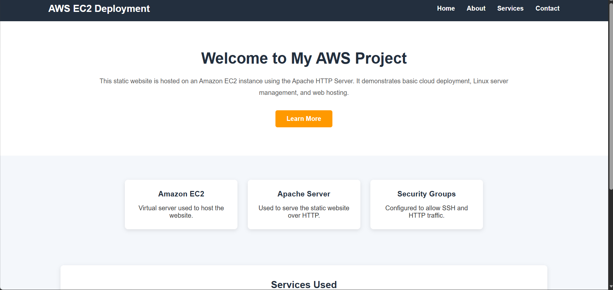
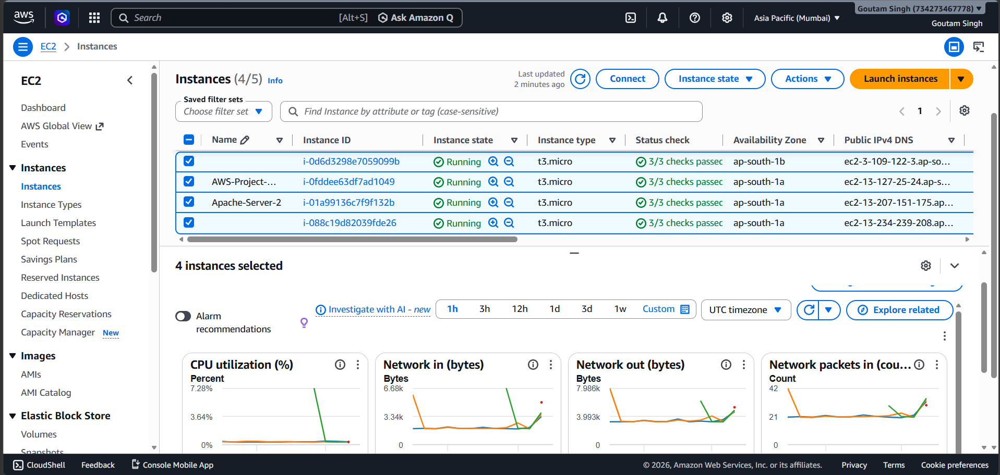
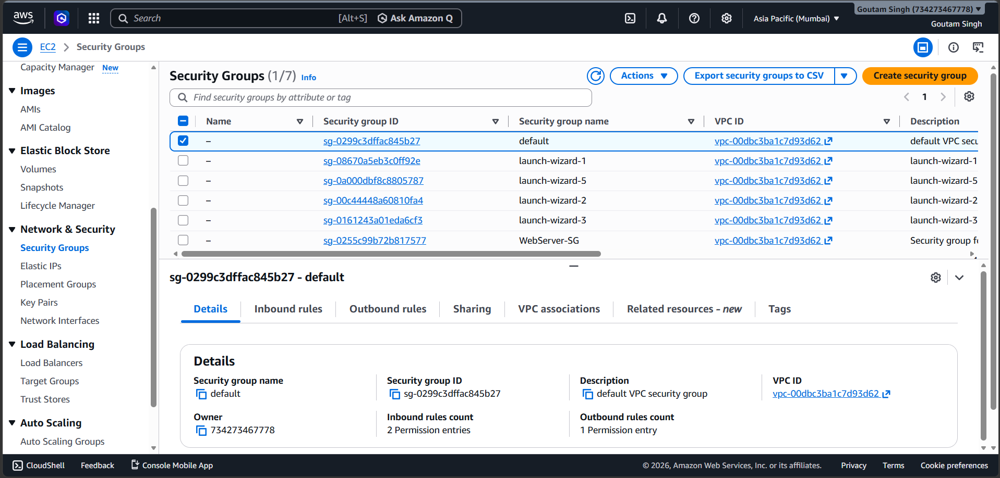
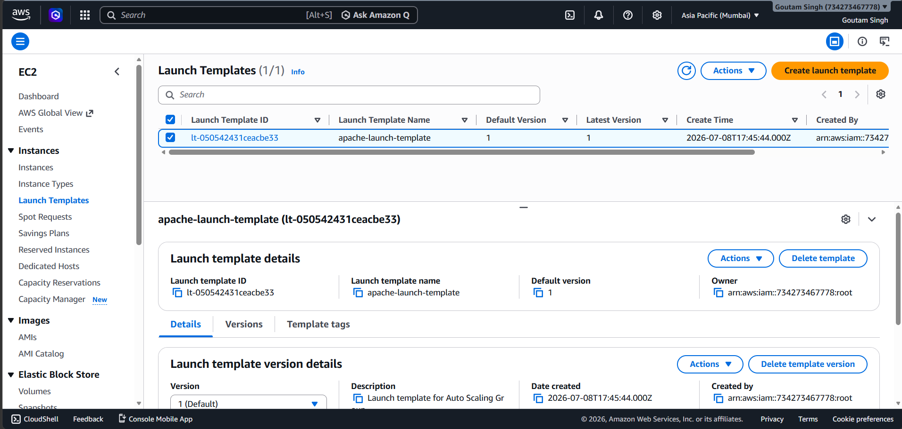
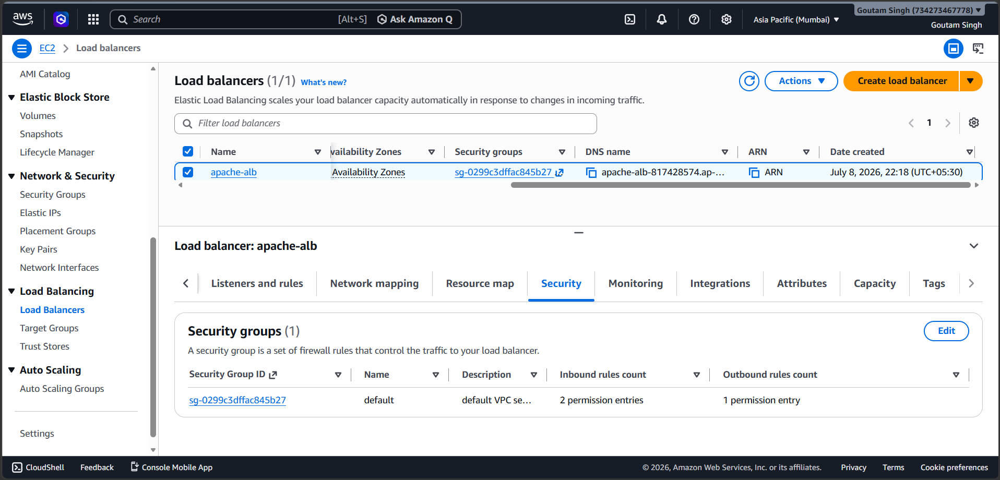
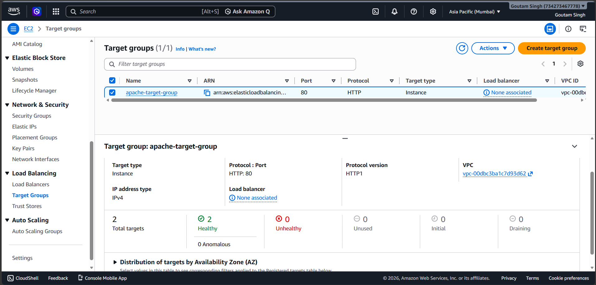
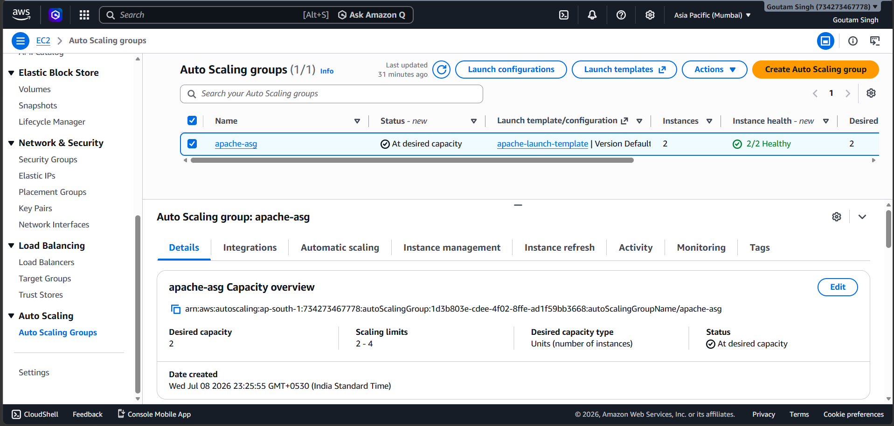

# AWS Static Website Deployment with Auto Scaling and Load Balancer

## 📌 Project Overview

This project demonstrates how to deploy a static website on an Amazon EC2 instance using the Apache HTTP Server. To improve the application's availability and scalability, AWS services such as Amazon Machine Image (AMI), Launch Template, Target Group, Application Load Balancer (ALB), and Auto Scaling Group (ASG) were configured.

The project provides hands-on experience with cloud infrastructure, Linux server management, web hosting, and AWS networking services.

---

## 🚀 Features

- Deploy a static website on Amazon EC2
- Configure Apache HTTP Server
- Create and use an Amazon Machine Image (AMI)
- Configure a Launch Template
- Create a Target Group
- Configure an Application Load Balancer (ALB)
- Create an Auto Scaling Group (ASG)
- Automatically distribute incoming traffic
- Improve application availability and scalability
- Configure Security Groups for secure access

---

## ☁ AWS Services Used

- Amazon EC2
- Amazon Linux
- Apache HTTP Server
- Security Groups
- Amazon Machine Image (AMI)
- Launch Template
- Target Group
- Application Load Balancer (ALB)
- Auto Scaling Group (ASG)
- SSH

---

## 🛠 Technologies Used

- HTML5
- CSS3
- AWS Cloud
- Apache HTTP Server
- Git
- GitHub
- Linux Commands

---

## 📂 Project Structure

```text
aws-static-website/
│
├── aws-screenshots/
│   ├── application-load-balancer.png
│   ├── auto-scaling-group.png
│   ├── ec2-instances.png
│   ├── launch-template.png
│   ├── security-group.png
│   └── target-group.png
│
├── images/
│   └── static-website.png
│
├── index.html
├── style.css
└── README.md
```

---

## ⚙ Deployment Steps

1. Launch an Amazon EC2 instance.
2. Connect to the instance using SSH.
3. Install the Apache HTTP Server.
4. Start and enable the Apache service.
5. Upload the website files (`index.html` and `style.css`).
6. Configure the Security Group to allow HTTP and SSH traffic.
7. Verify that the website is accessible using the EC2 public IP.
8. Create an Amazon Machine Image (AMI).
9. Create a Launch Template using the AMI.
10. Create a Target Group.
11. Configure an Application Load Balancer (ALB).
12. Create an Auto Scaling Group (ASG) using the Launch Template.
13. Verify that traffic is distributed correctly through the Load Balancer.

---

# 📸 Project Screenshots

## Static Website



---

## EC2 Instances



---

## Security Group



---

## Launch Template



---

## Application Load Balancer



---

## Target Group



---

## Auto Scaling Group



---

## 📚 Learning Outcomes

Through this project, I gained practical experience with:

- Amazon EC2 instance deployment
- Linux server management
- Apache HTTP Server configuration
- Security Group configuration
- Amazon Machine Image (AMI) creation
- Launch Template configuration
- Target Group configuration
- Application Load Balancer (ALB)
- Auto Scaling Group (ASG)
- Git and GitHub version control
- Static website deployment on AWS

---

## 👨‍💻 Author

**Goutam Singh Rathore**

B.Tech Computer Science & Engineering Student

Aspiring Cloud & Software Engineer

---

